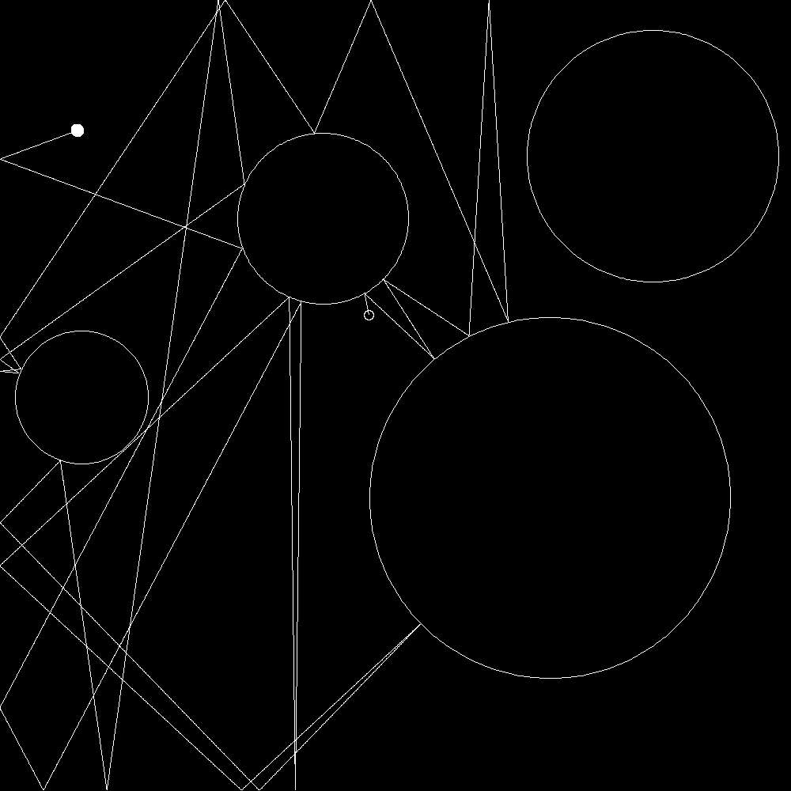

# Billard Dynamics

Makes a PNG of some circular obstacles and a ball that rolls off into space, obeying the laws of conservation of energy and Mr. Newton.

White - Start
Black - End

## To get the PIL import to work:

`pip install Pillow`

or

`brew install pil`

or

`pip2 install pillow`

or what worked for me:

`sudo pip3 install pillow`
